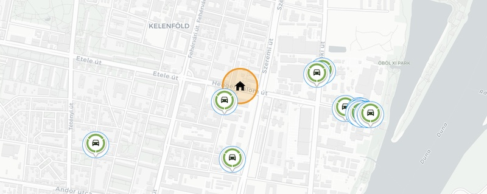
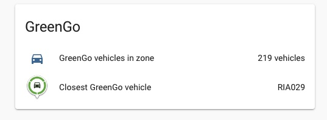
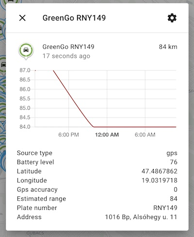
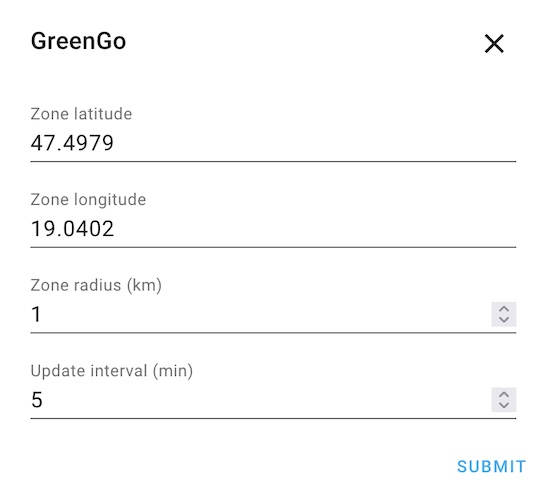

# GreenGo Home Assistant component

Custom component for [Home Assistant](https://homeassistant.io) that integrates [GreenGo](https://greengo.com) car-sharing data.

| Sensors | Vehicle details |
| ---- | ---- |
|  |  |

## Features

- Supported cities: Budapest, Prague
- Display vehicles as `device_tracker` entities on map
- Filter for vehicles in a zone with a given radius (around your home preferably)
- Sensors
    - Number of vehicles in zone
    - Closest vehicle

## Installation

1. Install [HACS](https://hacs.xyz/)
2. Add this as a custom repository to HACS (`https://github.com/ofalvai/home-assistant-greengo`)
3. Go to the integrations list in HACS and install this custom repo
4. Restart Home Assistant
5. Go to the Integrations page, click Add integrations and select GreenGo
6. Complete the config flow

## Configuration

Zone parameters and refresh interval can be configured when adding the integration to Home Assistant.

